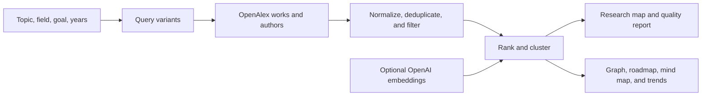

# Nomad

[](https://github.com/500ft/Nomad/actions/workflows/ci.yml)
[](https://nextjs.org/)
[](LICENSE)

A Next.js research-mapping app that ranks papers, researchers, subtopics,
citation signals, and source-linked project directions from an engineering query.

**[Quick start](#quick-start) · [Evaluation](docs/evaluation-results.md) · [Data and visuals](docs/data-and-figures.md) · [Configuration](#configuration)**

## Overview

Nomad turns a broad literature query into a smaller starting map: papers to read,
recent work to watch, researchers, topic clusters, a reading roadmap, and
project directions linked back to source records. The classic map is at `/`;
the v2 explorer at `/explore` adds a knowledge graph, mind map, trend radar, and
quality report.



OpenAlex is the primary data source. Nomad works without an OpenAI key by using
deterministic keyword, metadata, and citation signals. Citation-based ranks are
reading-order signals, not predictions of research value or future impact.

## Quick start

```bash
npm ci
npm run dev
```

Open [http://localhost:3000](http://localhost:3000) or
[http://localhost:3000/explore](http://localhost:3000/explore), then enter a
topic such as `machine learning for HVAC CFD`. Queries that name a method,
system, application, or measurable outcome usually map more cleanly than a
broad field name.

Run the local quality gates with:

```bash
npm run lint
npm test
npm run build
```

The test suite uses frozen OpenAlex fixtures where available; it does not need
network access or an OpenAI key. Current fixture coverage and gaps are listed in
[`docs/evaluation-results.md`](docs/evaluation-results.md).

## Configuration

| Variable | Required | Purpose |
| --- | --- | --- |
| `OPENALEX_MAILTO` | No | Adds a contact address to OpenAlex requests |
| `OPENAI_API_KEY` | No | Enables semantic relevance scoring |

Copy [`.env.example`](.env.example) to `.env.local`. Do not expose either value
through a `NEXT_PUBLIC_` variable.

## Documentation

| Document | Purpose |
| --- | --- |
| [`docs/evaluation-results.md`](docs/evaluation-results.md) | Current automated evaluation coverage, results, and missing evidence |
| [`docs/data-and-figures.md`](docs/data-and-figures.md) | OpenAlex lineage, ranking path, and runtime visualization production |
| [`docs/figure-manifest.json`](docs/figure-manifest.json) | Machine-readable map for diagrams and runtime visuals |
| [`PAPER_SELECTION_FRAMEWORK.md`](PAPER_SELECTION_FRAMEWORK.md) | Paper-selection logic |
| [`PAPER_RANKING_DEV_PLAN.md`](PAPER_RANKING_DEV_PLAN.md) | Ranking implementation plan |
| [`RELEVANCE_JUDGE_PLAN.md`](RELEVANCE_JUDGE_PLAN.md) | Optional relevance-judge plan |
| [`ROADMAP.md`](ROADMAP.md) | Release boundary and deferred work |

## Repository map

```text
app/page.tsx              classic research-map interface
app/explore/              v2 explorer and visualization components
app/api/research-map/     classic and v2 API routes
lib/openalex.ts           OpenAlex retrieval, caching, and normalization
lib/scoring.ts            deterministic ranking and project synthesis
lib/derive/               graph, mind map, roadmap, trends, and explanations
lib/quality/              relevance, subcluster, trend, and regression checks
test-fixtures/openalex/   frozen OpenAlex captures for topic-level evaluation
docs/                     evaluation and visualization lineage
```

See [`CONTRIBUTING.md`](CONTRIBUTING.md) for test, fixture, and UI requirements.
Nomad is available under the [MIT License](LICENSE).
