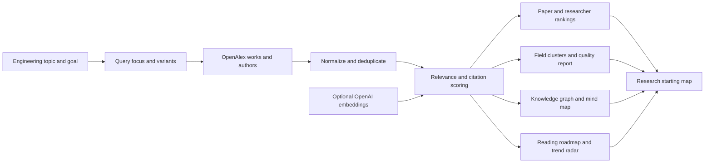

# Nomad

[](https://github.com/500ft/Nomad/actions/workflows/ci.yml)
[](https://nextjs.org/)
[](LICENSE)

A Next.js app that turns a mechanical-engineering topic into a ranked starting
map of papers, researchers, subtopics, citation signals, and source-linked
project directions.

**[Quick start](#quick-start) · [How it works](#how-it-works) · [Ranking](#ranking-and-data-quality) · [Configuration](#configuration) · [Development](#development)**

## Overview

Broad literature searches return more papers than a new researcher can assess.
Nomad narrows that first pass into practical reading and field-mapping views:

- foundational papers to read first;
- recently influential work to watch;
- active researchers;
- topic and keyword clusters;
- citation and data-quality signals; and
- project directions linked back to source papers.

The classic starting map is available at `/`. The v2 explorer at `/explore`
adds a knowledge graph, mind map, reading roadmap, trend radar, and a dedicated
quality report.

| | |
| --- | --- |
| **Application** | Next.js 15 and React 19 |
| **Interfaces** | Classic starting map at `/`; v2 explorer at `/explore` |
| **Primary source** | OpenAlex |
| **Default ranking** | Query relevance, source quality, and normalized citation signals |
| **Optional ranking** | OpenAI `text-embedding-3-small` semantic relevance |
| **Current scope** | Version 2: OpenAlex recall and deterministic evaluation |

## How it works



Nomad still runs when no OpenAI key is present. In that mode it uses keyword,
citation, and metadata scoring only, and reports the semantic fallback in the
result.

## Quick start

```bash
npm ci
npm run dev
```

Open [http://localhost:3000](http://localhost:3000) for the classic map or
[http://localhost:3000/explore](http://localhost:3000/explore) for the v2
explorer. Enter a topic such as:

```text
machine learning for HVAC CFD
```

Adding a method, application, system, or measurable outcome usually produces a
more focused map than a broad field name alone.

## Ranking and data quality

The result page exposes the signals used to assemble a map rather than showing
only a single opaque score.

| Signal | Use |
| --- | --- |
| Query relevance | Measures topic overlap after normalization |
| Citation rate | Helps compare papers of different ages |
| Source quality | Down-weights records with weak metadata |
| Recent influence | Highlights newer work with active citation history |
| Query-focus diagnostics | Reports median relevance, cluster count, and concentration |
| Subcluster and trend checks | Support the v2 field map, roadmap, and trend radar |
| Warnings | Flags broad queries, weak clusters, sparse abstracts, and fallback modes |

OpenAlex topics and keywords form the current field clusters, with title terms
as a fallback. Citation signals are context for reading order, not forecasts of
future importance.

## Configuration

| Variable | Required | Purpose |
| --- | --- | --- |
| `OPENALEX_MAILTO` | No | Routes requests through the OpenAlex polite pool |
| `OPENAI_API_KEY` | No | Enables semantic relevance scoring |

Copy [`.env.example`](.env.example) to `.env.local` for local development, then
fill only the variables you intend to use.

Example:

```bash
OPENALEX_MAILTO=you@example.com \
OPENAI_API_KEY=... \
npm run dev
```

Do not expose either value through a `NEXT_PUBLIC_` variable.

## Development

```bash
npm run lint
npm test
npm run build
```

CI runs all three commands on pushes and pull requests to `main`.

### Code map

```text
app/page.tsx              classic research-map interface
app/explore/              v2 explorer and visualization components
app/api/research-map/     classic and v2 API routes
lib/openalex.ts           OpenAlex retrieval and normalization
lib/query-focus.ts        query diagnostics and suggested refinements
lib/scoring.ts            deterministic paper and people ranking
lib/derive/               graph, mind map, roadmap, trend, and explanations
lib/quality/              relevance, subcluster, trend, and v2 quality checks
lib/embeddings.ts         optional semantic relevance
lib/validation.ts         request and response checks
```

### Project documents

| Document | Purpose |
| --- | --- |
| [`ROADMAP.md`](ROADMAP.md) | Current release boundary and deferred work |
| [`PAPER_SELECTION_FRAMEWORK.md`](PAPER_SELECTION_FRAMEWORK.md) | Paper-selection logic |
| [`PAPER_RANKING_DEV_PLAN.md`](PAPER_RANKING_DEV_PLAN.md) | Ranking implementation plan |
| [`RELEVANCE_JUDGE_PLAN.md`](RELEVANCE_JUDGE_PLAN.md) | Relevance evaluation plan |

Version 1 does not include accounts, saved reports, PDF export, embedding-based
clustering, industry mapping, lab ranking, or research timelines. See the
roadmap before expanding that boundary.

## Contributing

See [`CONTRIBUTING.md`](CONTRIBUTING.md) for test requirements, OpenAlex fixture
rules, and UI expectations.

## License

Nomad is available under the [MIT License](LICENSE).
