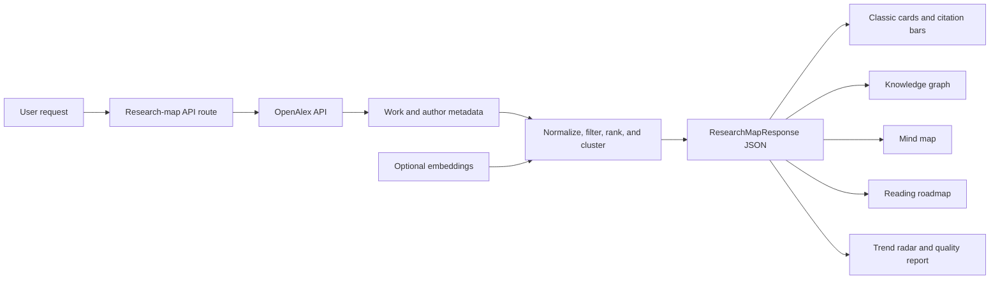

# Data and visual production

Nomad does not ship a static research dataset or a folder of result images. Most
data and visuals are produced at request time from OpenAlex responses. This
document traces that runtime path.



## Source data

`lib/openalex.ts` builds up to three search variants: the exact topic, a
field-scoped variant when supplied, and a core-term variant. Each request asks
OpenAlex for work identifiers, titles, publication dates, citation data,
authorships, topics, keywords, work type, retraction status, abstracts,
references, and related metadata. Results are deduplicated by normalized
OpenAlex work ID and cached in memory for one hour.

Live maps can change when OpenAlex changes its index, citation counts, metadata,
or search ordering. The UI links papers and authors back to OpenAlex records.
Frozen captures under `test-fixtures/openalex/` are used only for regression
tests, not as the production dataset.

## Ranking and derivation

`lib/scoring.ts` normalizes the OpenAlex records and computes relevance, source,
citation, recency, and shared-reference signals. `lib/query-focus.ts` describes
whether the retrieved set looks focused, broad, or sparse. `lib/quality/` adds
relevance diagnostics, cluster splitting, trend checks, and the v2 quality
report. `lib/derive/` turns the response into the roadmap, graph, mind map,
trend, and explanation structures.

If `OPENAI_API_KEY` is absent, the semantic score is unavailable and the
deterministic path remains active. OpenAI output is an optional ranking signal;
it does not create the source records or citation counts.

## Runtime visuals

### Knowledge graph

`lib/derive/graph.ts` creates topic, cluster, foundational-paper, rising-paper,
and author nodes with typed edges. `app/explore/_components/KnowledgeGraph.tsx`
lays them out on fixed radial rings. The force simulation is disabled after
positions are assigned; node dragging and canvas rendering come from
`react-force-graph-2d`.

The graph is not a citation-network reconstruction. Paper-to-cluster and
author-to-paper edges describe Nomad's derived map, while shared-reference
signals contribute separately to ranking.

### Citation bars

`app/page.tsx` renders recent nonzero yearly counts from OpenAlex
`counts_by_year`. If those counts are unavailable, the result explains the
fallback rather than fabricating a history. The bars are DOM and CSS elements,
not exported image files.

### Mind map, roadmap, and trend radar

The v2 components render structures produced by `lib/derive/mindmap.ts`,
`lib/derive/roadmap.ts`, and `lib/derive/trend.ts`. Their labels, paper choices,
and scores come from the same `ResearchMapResponse`; they are alternate views of
one response, not independent datasets.

## Reproduce a runtime view

```bash
npm ci
npm run dev
```

Open `/explore`, enter a query, and use the roadmap, trend, graph, and mind-map
tabs. Reproducing an identical live view requires the same request, environment
configuration, OpenAlex response, and application revision. For repeatable
pipeline tests, use:

```bash
npm test
```

## Static documentation diagram

The pipeline diagram in `README.md` is Mermaid source rendered by GitHub. It is
an architecture explanation, not a measured result. No screenshots or exported
plot files are currently committed.

See [`figure-manifest.json`](figure-manifest.json) for the machine-readable
visual map and [`evaluation-results.md`](evaluation-results.md) for test
coverage.
